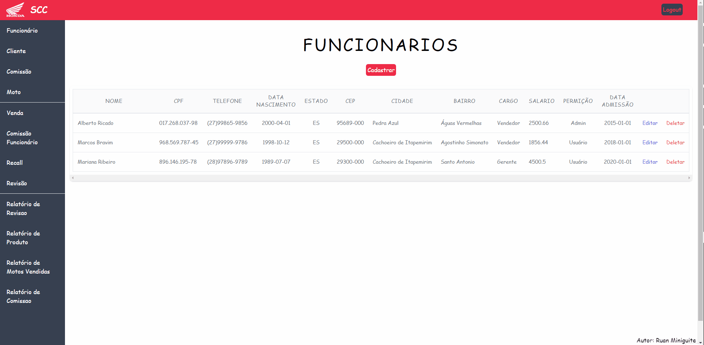

<!--  
  Ruan Pezzin Miniguite
  V. 3.0
-->


<!-- ============== HEADER ============== -->
<div align="center" id="header">

  
  

  ![GitHub repo size][GitHub repo size-shields]
  ![GitHub language count][GitHub language count-shields]
  ![GitHub forks][GitHub forks-shields]
  ![GitHub stars][GitHub stars-shields]
  [![GitHub License][GitHub License-shields]][GitHub License-link]
  [![Website][Website-shields]][Website-link]
  
</div>

---

<!-- ===== INDEX ===== -->
<details>
  <summary>Index</summary>
  <ol>
    <li><a href="#about-the-project">About The Project</a></li>
    <li><a href="#language-and-tools">Language and tools</a></li>
    <li><a href="#installation">Installation</a></li>
    <li><a href="#license">License</a></li>
    <li><a href="#author">Author</a></li>
  </ol>
</details>


<!-- ============== ABOUT ============== -->
## About the project

<p>The dealership management system will detail the purposes of purchasing, canceling purchases, employee commission program, review system, recall system, and budgeting for a motorcycle dealership. The objective of this system is the possibility of optimizing time during purchases, facilitating customer management and generating greater security for the dealership's processes, helping to control sales and facilitating the maintenance of the records necessary for the proper functioning of the system.</p>


<div align="center" id="header">
  <a href=""></a>
</div><br>


#### Comandos
```
npm i --save 
```
```
npm i axios --save
```
```
cd .\scc-frontend-react
```
```
npm run dev
```


<!-- ============== LANGUAGE ============== -->
## Language and tools

```
> JavaScript
```


<!-- ============== INSTALLATION ============== -->
## Installation

#### Git Clone
```
Git Clone https://github.com/RuanMiniguite/SCC-frontend-react.git
```


<!-- ============== LICENSE ============== -->
## License

Copyright © 2023.<br />
This project is [MIT][GitHub License-link] licensed.


<!-- ============== AUTHOR ============== -->
## Author

|[<br><sub>@LuizHenrique</sub>](https://github.com/hencabral)| [<br><sub>@NataliaPitanga</sub>](https://github.com/nataliap96)|[<br><sub>@PatriciaDaros</sub>](https://github.com/PatriciaDaros)|[<br><sub>@RuanMiniguite</sub>](https://github.com/RuanMiniguite)|
|:-|:-|:-|:-|

<p align="right">(<a href="#header">back to top</a>)</p>


<!-- ============== LINKs ============== -->
<!-- Alterar link -->
[Site-link]: https://github.com/RuanMiniguite/SCC-frontend-react
[GitHub License-link]: https://github.com/RuanMiniguite/SCC-backend-spring/blob/ccad68212125b4e96fbbe1412bc7c7948dafcc47/LICENSE

<!-- Alterar caminho para repositorio [Template-Readme] -->
[GitHub repo size-shields]: https://img.shields.io/github/repo-size/RuanMiniguite/SCC-frontend-react?style=for-the-badge&color=292929
[GitHub language count-shields]: https://img.shields.io/github/languages/count/RuanMiniguite/SCC-frontend-react?style=for-the-badge&color=292929
[GitHub forks-shields]: https://img.shields.io/github/forks/RuanMiniguite/SCC-frontend-react?style=for-the-badge&color=292929
[GitHub stars-shields]: https://img.shields.io/github/stars/RuanMiniguite/SCC-frontend-react?style=for-the-badge&color=292929

<!-- Permalink Shields-->
[GitHub License-shields]: https://img.shields.io/cocoapods/l/m?down_color=292929&up_color=292929&color=292929&style=for-the-badge
[Site-shields]: https://img.shields.io/badge/Site-Live-292929?style=for-the-badge&logo=web&logoColor=white
[Website-link]: https://github.com/RuanMiniguite/Commit-Message
[Website-shields]: https://img.shields.io/website?down_color=292929&down_message=404&style=for-the-badge&logo=github&up_color=292929&up_message=Commit&url=https%3A%2F%2Fgithub.com%2FRuanMiniguite%2FCommit-Message
